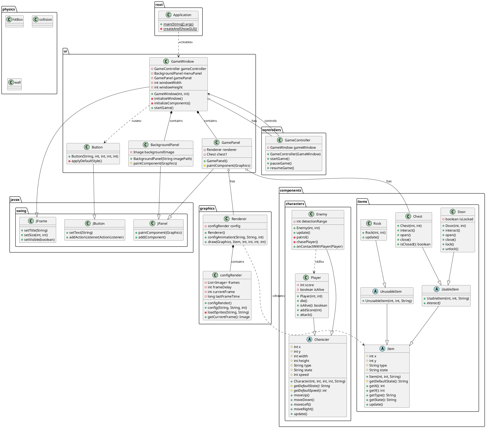
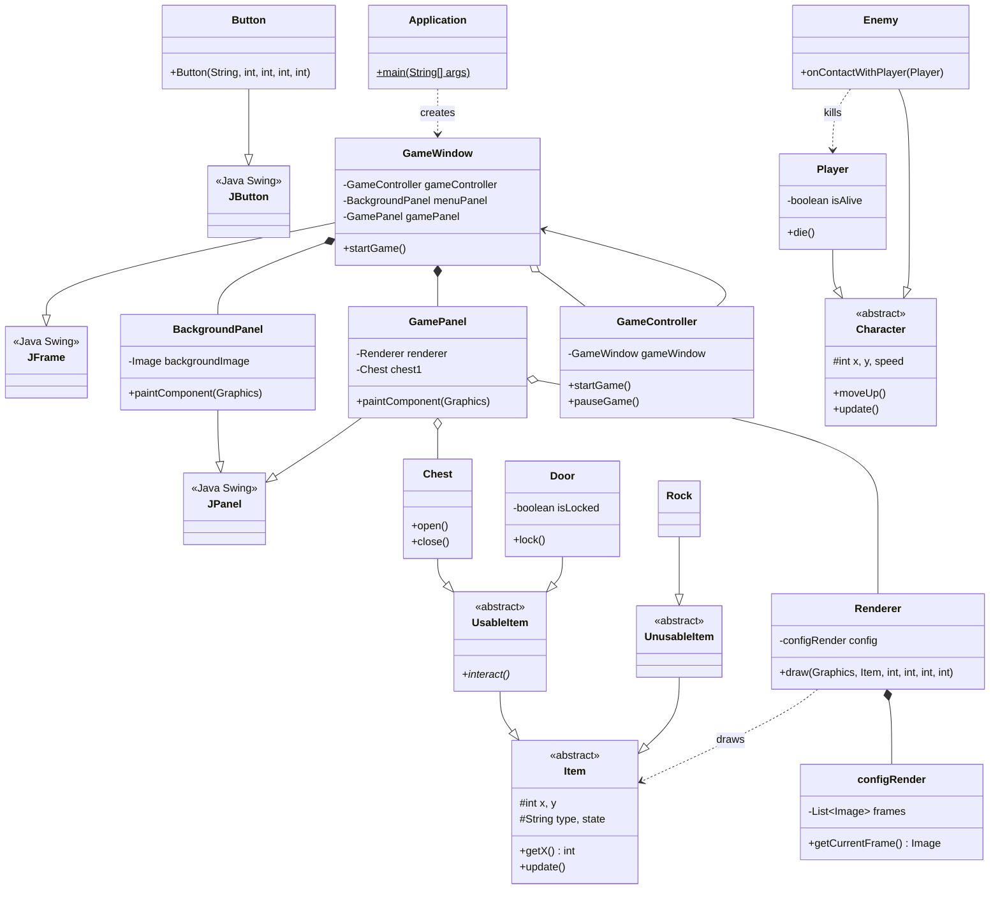

# Escape from OOP - Complete UML Class Diagram

## Full Class Diagram with All Relationships



## Simplified Mermaid Diagram (Core Classes Only)



## Architecture Layers

```
┌─────────────────────────────────────────────┐
│          Application (Entry Point)          │
└─────────────────┬───────────────────────────┘
                  │
┌─────────────────▼───────────────────────────┐
│               UI Layer                      │
│  ┌─────────────────────────────────────┐   │
│  │ GameWindow (JFrame)                 │   │
│  │  ├─ BackgroundPanel (JPanel)        │   │
│  │  ├─ GamePanel (JPanel)              │   │
│  │  └─ Button (JButton)                │   │
│  └─────────────────────────────────────┘   │
└─────────────────┬───────────────────────────┘
                  │
┌─────────────────▼───────────────────────────┐
│           Controller Layer                  │
│          GameController                     │
└─────────────────┬───────────────────────────┘
                  │
┌─────────────────▼───────────────────────────┐
│           Graphics Layer                    │
│  Renderer + configRender                    │
└─────────────────┬───────────────────────────┘
                  │
┌─────────────────▼───────────────────────────┐
│          Components Layer                   │
│  ┌────────────────┬─────────────────┐       │
│  │   Characters   │     Items       │       │
│  │  ├─ Player     │  ├─ Chest       │       │
│  │  └─ Enemy      │  ├─ Door        │       │
│  │                │  └─ Rock        │       │
│  └────────────────┴─────────────────┘       │
└─────────────────────────────────────────────┘
```

## Recommendations for UML Tool

Để vẽ UML chính xác hơn, bạn nên dùng:

1. **PlantUML** (Khuyến nghị - code ở trên) 
   - Online: https://www.plantuml.com/plantuml/uml/
   - VS Code Extension: "PlantUML"
   
2. **draw.io** (Visual, dễ dùng)
   - https://app.diagrams.net/
   
3. **Lucidchart** (Professional)
   - https://www.lucidchart.com/

Mermaid có hạn chế về layout phức tạp, nên dùng PlantUML cho diagram đầy đủ hơn.
